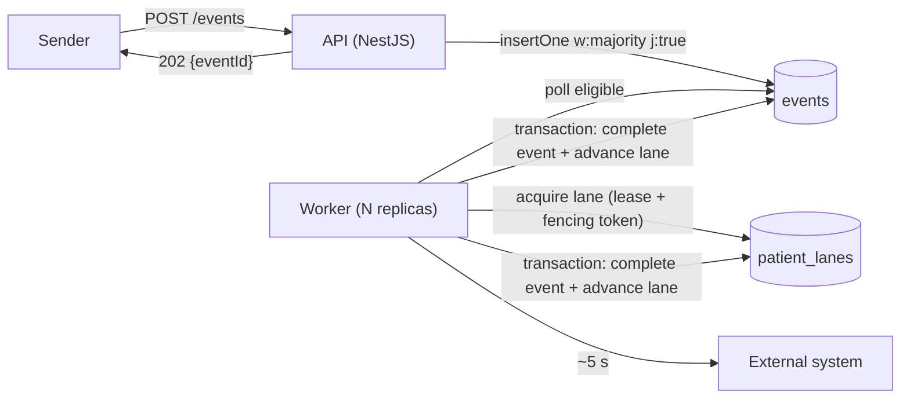
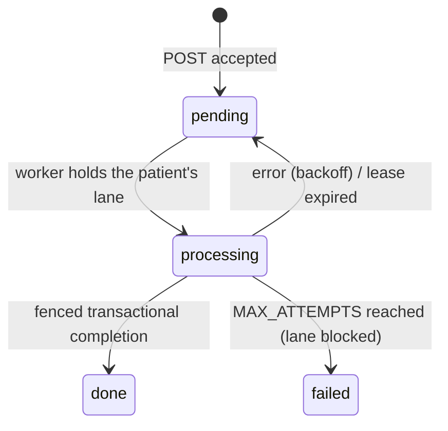

# Adentris Ingest Service

A NestJS + MongoDB service that accepts patient events over HTTP, answers immediately with `202 Accepted`, and processes each event asynchronously (a simulated 5-second external call) while holding up under duplicate deliveries, out-of-order arrival, per-patient ordering requirements and processes being killed at arbitrary moments. MongoDB is both the system of record and the queue: there is no Redis, Kafka or other broker.

## Quick start

```bash
docker compose up --build                 # MongoDB (replica set) + API + worker
docker compose up --build --scale worker=2   # two workers

curl -i -X POST localhost:3000/events \
  -H 'content-type: application/json' \
  -H 'Idempotency-Key: demo-1' \
  -d '{"patientId":"p1","type":"vitals","data":{"hr":72},"ts":"2024-05-01T10:00:00Z"}'
# 202 {"eventId":"...","status":"pending","duplicate":false}

curl localhost:3000/events/<eventId>      # status, appliedSeq, outOfOrder, result (never `data`)
curl localhost:3000/stats                 # counts by status, oldest pending age, blocked lanes
curl localhost:3000/health/ready          # MongoDB ping
```

Local development (needs a MongoDB replica set, e.g. `docker compose up mongo`):

```bash
npm ci
npm run dev:api        # and, in another terminal:
npm run dev:worker
npm test               # unit + integration (downloads a mongod binary on first run)
```

## Architecture





The API and the worker are two entrypoints (`main.api.ts`, `main.worker.ts`) of the same image. Code is layered per feature (`domain` has no NestJS or MongoDB imports; `application` holds use cases and ports; `infrastructure` holds the MongoDB adapters):

```
src/events/       POST/GET /events, idempotency, reorder window
src/processing/   lanes, retry policy, drain-a-lane use case, fenced completion, worker loop
src/ops/          /health, /stats
src/database/     MongoClient provider, index bootstrap
```

## How the brief's conditions are handled

| Condition | Risk | Mechanism |
|---|---|---|
| 1000 events/min, growing | ~84 events in flight (Little's law) | Durable queue, I/O-bound worker with `WORKER_CONCURRENCY` lanes, horizontally scalable (`--scale worker=N`) |
| Senders retry and duplicate | Same event arrives 2+ times, sometimes in parallel | Unique `idempotencyKey` index; duplicate returns the same `eventId` |
| No ordering guarantee on arrival | Arrival order differs from event order | Process by `ts` (tie-break `receivedAt`, `_id`), not by arrival |
| State depends on sequence per patient | Two events of one patient applied in parallel or out of order | One lane per patient: a single worker at a time, always the lowest `ts` first |
| Never lose, never count twice | Lost on crash / double write by a stale worker | `202` only after `w:majority, j:true`; leases + fencing token + transactional completion |
| Processes die at any moment | Event stuck in `processing`; zombie worker writing late | Lease expiry lets another worker take over; the zombie's write is rejected by the fencing token |
| Sender needs an immediate answer | Cannot wait 5 s | Async `202` + `GET /events/:id` |

## Key decisions

**MongoDB as the queue.** The accept-write *is* the enqueue, so there is no dual-write window where an event is stored but not queued (or the reverse). BullMQ/Redis or RabbitMQ would add that window plus another durability story; Kafka orders by arrival rather than event time and is heavy to run locally. Trade-off: polling instead of push, and I own leases and indexes.

**Idempotency.** `Idempotency-Key` header when present (`hdr:<key>`), otherwise `sha256` of the canonical payload (`body:<hash>`); the prefix stops a client key from colliding with a derived one. Canonicalisation normalises `ts` through `Date` and sorts object keys recursively. A unique index makes concurrent duplicates safe: the loser gets `E11000`, reads the winner and returns the same `eventId`. Same key with a different payload returns `409`. Trade-off: two genuinely distinct but byte-identical events fuse (acceptable for clinical measurements, and stated here).

**Per-patient lanes.** "Take the oldest pending event of a patient that has nothing in `processing`" spans several documents, and MongoDB only gives atomic conditional writes per document (even transactions do not prevent write skew without a shared document). The `patient_lanes` document is that shared document: workers take it with one conditional `findOneAndUpdate`.

**Leases and fencing.** Acquiring a lane writes a fresh UUID token and a `lockedUntil`. The lease is renewed before every claim and again on completion. Completion runs in a transaction that updates the lane *only if the token still matches* and then the event *only if still `processing` with that token*; otherwise it throws `LeaseLostError` and the work is discarded. A worker that stalled past its lease therefore cannot record anything.

**Completion is transactional, the external call is not.** The 5 s call never sits inside a transaction. Processing is therefore **at-least-once** against the external system (the `idempotencyKey` is passed along so it can dedupe), while the **recording** is exactly-once. True end-to-end exactly-once is impossible without the external system's cooperation.

**Reorder window and `outOfOrder`.** An event becomes eligible at `clamp(ts + REORDER_WINDOW_MS, receivedAt, receivedAt + REORDER_WINDOW_MS)`, so delays shorter than the window are reordered for free. Later arrivals are still processed but flagged `outOfOrder: true` (visible on the event and in `/stats`), never silently. Actually correcting prior state needs domain logic and replay (see below).

**Blocked lane on a poison event.** After `MAX_ATTEMPTS` (exponential backoff, full jitter) the event becomes `failed` and its patient's lane stays blocked rather than skipping ahead, because skipping would break the sequence. Correctness over availability; surfaced by `/stats.blockedLanes`.

**API/worker split.** Different scaling profiles and failure domains; a worker deploy or crash does not stop ingestion.

## Capacity

- Today: 1000/min ≈ 16.7/s × 5 s ≈ **84 events in flight**. One worker with `WORKER_CONCURRENCY=200` covers it; MongoDB sees roughly 100 ops/s.
- 10×: ~840 in flight → a few worker replicas. Lanes are claimed dynamically, so there is no rebalancing.
- **Per-patient ceiling: 12 events/min** (serial × 5 s). A patient sustained above that grows an unbounded backlog. That follows from "order matters" × "5 s each", not from the implementation; the way out is reading B below or batching in the external call.
- Next bottleneck: polling by many workers. Change streams as a wake-up (with polling as fallback), then a partitioned broker behind the repository ports.

## Proving it

```bash
docker compose up --build -d --scale worker=2
npm run load -- --duration 300 &       # 1000/min, 300 patients, 10% duplicates, 20 s shuffle, retries
npm run chaos &                        # SIGKILL a random worker every 20-60 s (add --api via `bash scripts/chaos.sh --api`)
wait %1; kill %2
npm run verify                         # waits for the queue to drain, then checks the guarantees
```

`verify` exits non-zero on any violation:

| Check | Proves |
|---|---|
| each logical event got exactly one distinct `eventId` | idempotency across concurrent and delayed duplicates |
| every acknowledged event exists and is `done` | nothing lost |
| document count == logical event count; one doc per key | nothing duplicated |
| `appliedSeq` contiguous `1..n` per patient | no double-counting, no gaps |
| `ts` non-decreasing per patient except flagged `outOfOrder` | ordering (and that late arrivals are flagged iff they are late) |
| `[startedAt, processedAt]` intervals never overlap per patient | serialisation |

Sample result from a local run (2 workers, 120 s at 1000/min, three worker `SIGKILL`s, defaults otherwise):

```
2000 logical events, 300 patients, 2200 HTTP requests (all 202), http p50=5.8ms p95=14.7ms
PASS every logical event got exactly one distinct eventId
PASS nothing lost: every acknowledged event exists and is done
PASS nothing duplicated: 2000 documents for 2000 logical events
PASS per patient, appliedSeq is contiguous 1..n
PASS per patient, ts is non-decreasing except flagged outOfOrder events
PASS per patient, processing intervals never overlap
outOfOrder: 126 (shuffle window of 20 s exceeds the 10 s reorder window)
max attempts on one event: 3 (events interrupted by a kill are re-run once the lease expires)
end-to-end latency ms: p50=8208 p95=39154 p99=56697
```

## Testing

`npm test` runs unit tests and integration tests against a real single-node MongoDB replica set (`mongodb-memory-server`), because transactions and write concern are the point.

- Unit: canonicalisation and hashing, key resolution, reorder-window clamp, retry policy, config validation.
- Integration, ingest: `202`/`400`/`413`, 20 concurrent identical POSTs → one document and one `eventId`, `409` on key reuse, `503` + `Retry-After` when MongoDB is unreachable, `GET` semantics.
- Integration, processing: shuffled input processed in `ts` order with `appliedSeq 1..n`; two workers never overlap on a patient while different patients run concurrently; an abandoned event is finished exactly once after the lease expires; a zombie's completion is rejected and nothing is double counted; retry/backoff, `failed` and blocked lanes; `outOfOrder` flagging; the head is never skipped while in backoff; lane batching; graceful shutdown waits for in-flight work.

A `FakeClock` and a `ControllableProcessor` replace time and the external system, so nothing sleeps for 5 s.

## Configuration

| Variable | Default | Meaning |
|---|---|---|
| `PORT` | `3000` | API port |
| `MONGO_URI` | `mongodb://localhost:27017/ingest?replicaSet=rs0&directConnection=true` | Use `directConnection=true` outside Docker |
| `MONGO_DB` | `ingest` | Database name |
| `PROCESSING_DELAY_MS` | `5000` | Simulated external call duration |
| `SIMULATED_FAILURE_RATE` | `0` | 0–1, random failures to demo retries |
| `PROCESS_TIMEOUT_MS` | `15000` | Abort the external call after this |
| `LEASE_MS` | `30000` | Lane lease; must exceed `PROCESS_TIMEOUT_MS` (validated at boot) |
| `WORKER_CONCURRENCY` | `200` | Lanes drained concurrently per worker |
| `POLL_INTERVAL_MS` | `500` | Idle poll interval |
| `LANE_BATCH` | `10` | Max events per lane acquisition (fairness) |
| `MAX_ATTEMPTS` | `5` | Then `failed` and the lane is blocked |
| `BACKOFF_BASE_MS` / `BACKOFF_MAX_MS` | `1000` / `60000` | Exponential backoff with full jitter |
| `REORDER_WINDOW_MS` | `10000` | Watermark; `0` disables |
| `SHUTDOWN_GRACE_MS` | `25000` | Must stay below the container stop timeout (30 s in compose) |
| `MAX_BODY_BYTES` | `262144` | Request body limit |

Invalid configuration fails fast on boot with every problem listed.

## Assumptions

- Senders give no stable event id; an `Idempotency-Key` header is used when sent, otherwise identity is derived from the payload.
- The sender's `ts` is trusted (clock skew is only bounded by the reorder-window clamp).
- **Reading A** of "result depends on the sequence in which events are applied": the processing itself is order-dependent, so it is serialised per patient. **Reading B** (only the final application is order-sensitive) would allow processing events in parallel and folding results in `ts` order with replay, which removes the 12/min ceiling and handles late events properly. A is the safe choice if the assumption is wrong; B is what I would move to once confirmed.
- "A single MongoDB collection" is read as: events and their outcomes live in one collection (`events`). Per-patient coordination documents (`patient_lanes`) are infrastructure metadata. If that is not acceptable they can live in `events` with a discriminator, at the cost of partial indexes.
- No PHI in logs: only `eventId`, `patientId`, `type`, status and attempts are logged, never `data`.

## Trade-offs accepted

- At-least-once against the external system; exactly-once only for the recorded result.
- Per-patient throughput capped at 12 events/min.
- A poison event blocks its patient's lane until an operator intervenes.
- Byte-identical events without an `Idempotency-Key` are merged.
- Reorder window adds up to `REORDER_WINDOW_MS` of latency; later arrivals are flagged, not corrected.
- Polling MongoDB instead of a broker; the eligibility query also re-scans `processing` rows so orphans of dead workers are found, so a live lane owned by another worker costs one failed acquire per poll.
- A second collection for coordination.
- Orphan re-claims count as attempts, but a crash-looping poison event that kills the worker before it can record a failure is not detected beyond the attempt counter.

## What I would do with more time

Confirm reading B and implement parallel processing with ordered replay; an operator endpoint to retry or skip blocked lanes; change streams as a wake-up; backlog-based autoscaling metric and `429` backpressure; Prometheus metrics and tracing; retention/archival; moving the queue behind a broker (partitioned by `patientId`) via the existing repository ports; property-based ordering tests (fast-check); per-sender auth and idempotency-key scoping.

## Implementation notes

- Pinned to NestJS 11 and `mongodb` 6: NestJS 12 is ESM-only (incompatible with the CommonJS build used here) and `mongodb` 7.7 failed its handshake against the test `mongod`.
- The worker's eligibility query includes `processing` events (the spec only matched `pending`), otherwise an event orphaned by a killed worker would never be picked up again. Found by the crash-recovery integration test.
- The lease is renewed before each claim so a worker that lost its lane cannot re-claim an event owned by its successor.
